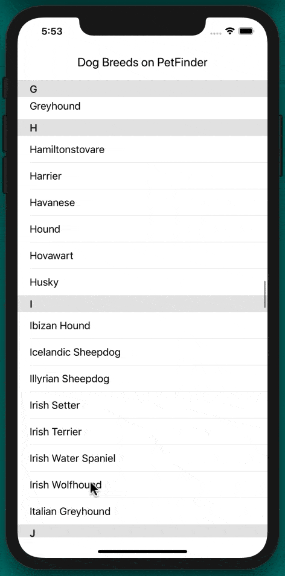
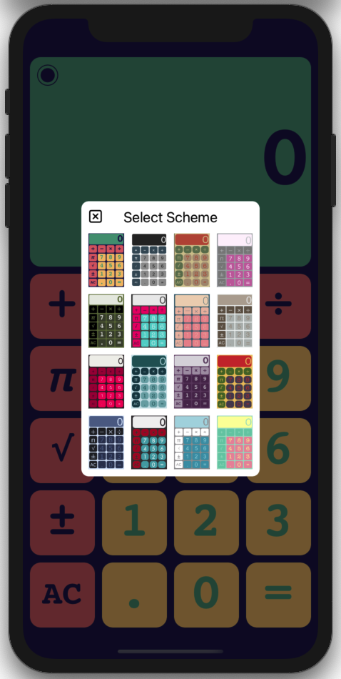
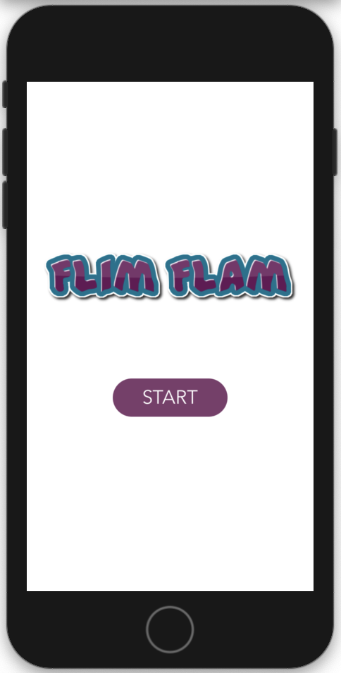
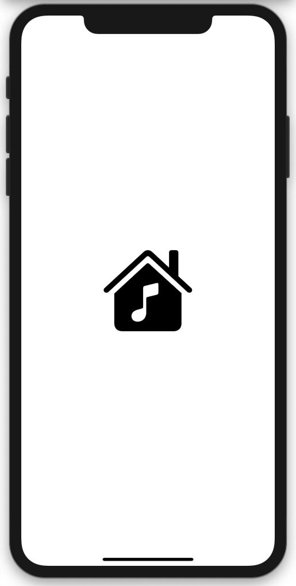

# Quickies

An assortment of Swift apps

## GIF Player

[GIFPlayer](https://github.com/PepperoniJoe/GIFPlayer) - A Swift app that plays GIF files as animated images.

**Technical Info:**\
Xcode12 project written in Swift 5 for iOS\
GIF files, animation, tap gestures, collection views, tab bar controller\
collection view flow layout, imageview.animationImages, storyboard references\
data assets, CGImageSourceGetCount, CGImageSourceCreateImageAtIndex\
UIImage.animatedImage, color assets\
Apple Keynote: magic move, rotate, shimmer, bounce, jiggle

***

## Twitter News

[TwitterNews](https://github.com/PepperoniJoe/TwitterNews) - A Twitter News reader created to display the Twitter logo animation.

**Technical Info:** \
Xcode 11  project written in Swift 5 for iOS\
Webview, UIView.animate, animations

***

## Hexadecimal Keyboard

[HexadecimalKeyboard](https://github.com/PepperoniJoe/HexadecimalKeyboard) - A custom hexadecimal keyboard that can be added to other apps.

**Technical Info:**\
Xcode12 project written in Swift 5 for iOS\
Inputview, UIKeyInput protocol, Custom delegate/protocol for removing keyboard\
System colors for dark/light modes

***

## US Exchange Rates

[Exchange Rates](https://github.com/PepperoniJoe/ExchangeRates) - US currency exchange rates

**Technical Info:**\
Xcode12 project written in Swift 5 for iOS 14\
URLSession, JSONDecoder, Decodable, Date/Calendar components, Timer,\
Refresh Controls, Tableview, Tableview Cell Styles, Storyboards

***

# My Father's Dragon

[MyFathersDragon](https://github.com/PepperoniJoe/MyFathersDragon) - An iOS app displaying a public domain children's book.

**Technical Info:**\
Xcode 12 project written in Swift 5 for iOS 14\
UIPageViewController

***

## PetFinder

[PetFinder](https://github.com/PepperoniJoe/PetFinder) - A native iOS app for demonstrating REST API calls using tokens, asynchronous communication and a dispatch group.

**Technical Info:**\
Xcode11 project written in Swift 5 for iOS\
REST API with token, Asynchronous communication, DispatchGroup, delegation pattern,\
URLSession, JSONDecoder, Decodable protocol, Dictionaries, tuples, sorting nested arrays,\
UITableView with section detail and section headers

***

## Animated Logo

[AnimatedLogo](https://github.com/PepperoniJoe/AnimatedLogo) - An iOS app displaying a 7x7 animated grid

**Technical Info:**\
Xcode12 project written in Swift 5.3 for iOS 14\
SpriteKit, SKScene, SKView, SKActions, SKLabelNode, SKNode

***

## Animated To Do

[AnimatedToDo](https://github.com/PepperoniJoe/AnimateToDo) - An app with a colorful animated list of To Do items

  

**Technical Info:** \
Xcode 11 project written in Swift 5 for iOS\
tableView, gradient layers, rounded corners, DispatchQueue, layers\
UIView.animate, CGAffineTransform, spring transitions, array of tuples, color schemes

***

## Emoji Slot Machine

[EmojiSlotMachine](https://github.com/PepperoniJoe/EmojiSlotMachine) - A simple slot machine with emojis and sound effects

  

**Technical Info:** \
Xcode 11 project written in Swift 5 for iOS\
pickerview, randomization, AVAudioPlayer, cornerRadius\
traitCollectionDidChange, userInterfaceStyle, UIView.animate

***

## Voices

[Voices](https://github.com/PepperoniJoe/Voices) - Type text and have one of many voices read it back.

**Technical Info:**\
Xcode11 project written in Swift 5 for iOS\
AVFoundation, Voice Synthesizer, UIPickerView, UITextView, Popup Keyboard

***

## Calculator

[Calculator](https://github.com/PepperoniJoe/Calculator) - A colorful calculator app.

**Technical Info:**\
Xcode12 project written in Swift 5 for iOS\
Delegate Pattern, Protocols, Extensions, Enums, User Defaults, Tuples, Outlet Collections,\
Functions as Parameters, Number Formatter, Hidden Status Bar, Unit Tests, UI Tests,\
Presenting/Dismissing of view controllers

***

## Flim Flam

[Flim-Flam](https://github.com/PepperoniJoe/Flim-Flam) - An app with puzzling questions.

**Technical Info:** \
Xcode 12 project written in Swift 5 for iOS 13\
page view controller, UIView.animate, segue, page curl transitions

***

## Music With Color

[MusicWithColor](https://github.com/PepperoniJoe/MusicWithColor) - Plays music while randomly generating colors and patterns

  

**Technical Info:**\
Xcode 11 project written in Swift 5 for iOS\
Notification Center, Timer, AVAudioPlayer, CAGradientLayerTypes, Randomization

***

# Also, check out the following iOS developer tools #

## Make Icons Swiftly

[Make-Icons-Swiftly](https://github.com/PepperoniJoe/Make-Icons-Swiftly) -
An Apple Developer tool to generate app icons and images for iPhone, iPad, Mac, Apple TV, Apple Watch and Car Play

## Dark Mode Colors

[DarkModeColors](https://github.com/PepperoniJoe/DarkModeColors) -
View all system colors that vary depending on the iOS trait environment. Check how each color looks in dark and regular modes.

  

**Author:** \
Marcy Vernon [@MarcyVernon](https://twitter.com/MarcyVernon)

**License:** \
"Quickies" is under the MIT license. See [LICENSE](/LICENSE) for more information.
