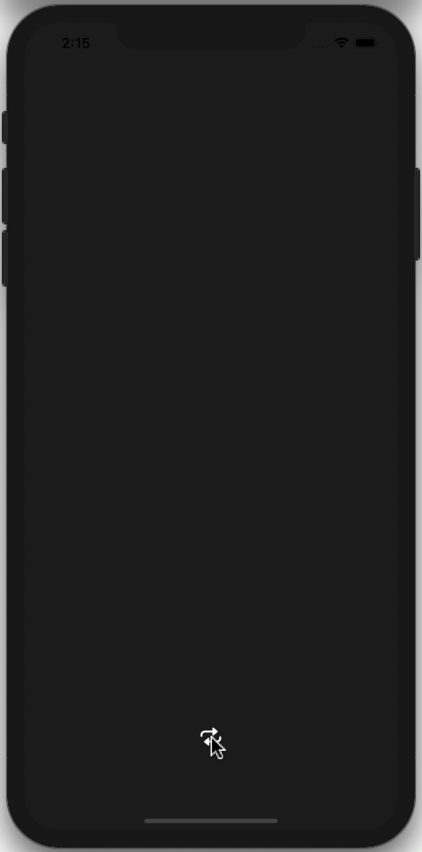
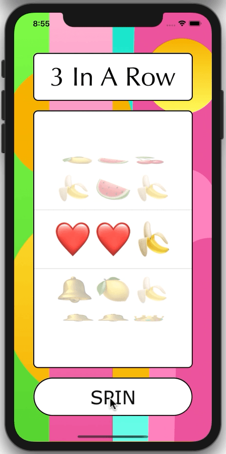
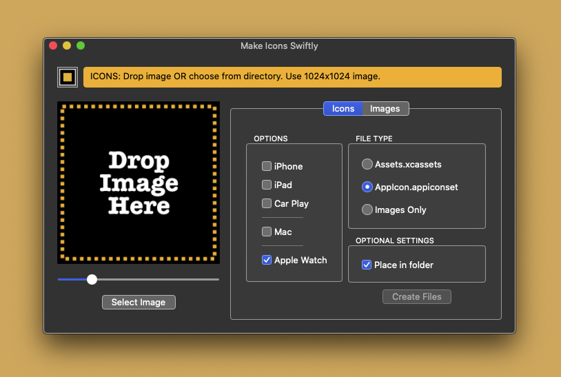
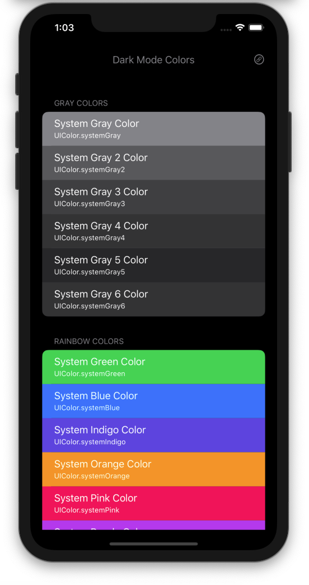

# Quickies

An assortment of small iOS apps

## Twitter News

[TwitterNews](https://github.com/PepperoniJoe/TwitterNews) - A Twitter News reader created to display the Twitter logo animation.

## My Father's Dragon

[MyFathersDragon](https://github.com/PepperoniJoe/MyFathersDragon) - An iOS app displaying a public domain children's book.

## Animated To Do

[AnimatedToDo](https://github.com/PepperoniJoe/AnimateToDo) - An app with a colorful animated list of To Do items

  

## Animated Logo

[AnimatedLogo](https://github.com/PepperoniJoe/AnimatedLogo) - An iOS app displaying a 7x7 animated grid

## Emoji Slot Machine

[EmojiSlotMachine](https://github.com/PepperoniJoe/EmojiSlotMachine) - A simple slot machine with emojis and sound effects

  

## Voices

[Voices](https://github.com/PepperoniJoe/Voices) - Type text and have one of many voices read it back.

## Hexadecimal Keyboard

[HexadecimalKeyboard](https://github.com/PepperoniJoe/HexadecimalKeyboard) - A custom hexadecimal keyboard that can be added to other apps.

## Calculator

[Calculator](https://github.com/PepperoniJoe/Calculator) - A colorful calculator app.

## Flim Flam

[Flim-Flam](https://github.com/PepperoniJoe/Flim-Flam) - An app with puzzling questions.

## Music With Color

[MusicWithColor](https://github.com/PepperoniJoe/MusicWithColor) - Plays music while randomly generating colors and patterns

  

# Also, check out the following iOS developer tools #

## Make Icons Swiftly

[Make-Icons-Swiftly](https://github.com/PepperoniJoe/Make-Icons-Swiftly) -
An Apple Developer tool to generate app icons and images for iPhone, iPad, Mac, Apple TV, Apple Watch and Car Play

## Dark Mode Colors

[DarkModeColors](https://github.com/PepperoniJoe/DarkModeColors) -
View all system colors that vary depending on the iOS trait environment. Check how each color looks in dark and regular modes.

  

**Author:** \
Marcy Vernon [@MarcyVernon](https://twitter.com/MarcyVernon)

**License:** \
"Quickies" is under the MIT license. See [LICENSE](/LICENSE) for more information.
